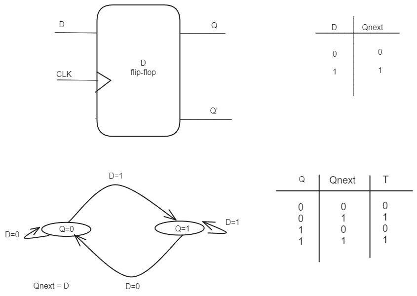
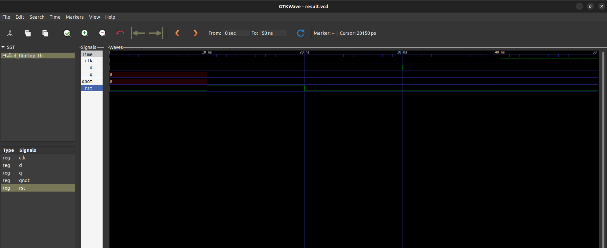

# Question
Write a VHDL code for a D flipflop.(2079 back)

# Files

- `d_flipflop.vhdl`: vhdl code for d flip-flop
- `d_flipflop_tb.vhdl`: vhdl code for testbench

# D Flipflop diagram

# Simulation result

