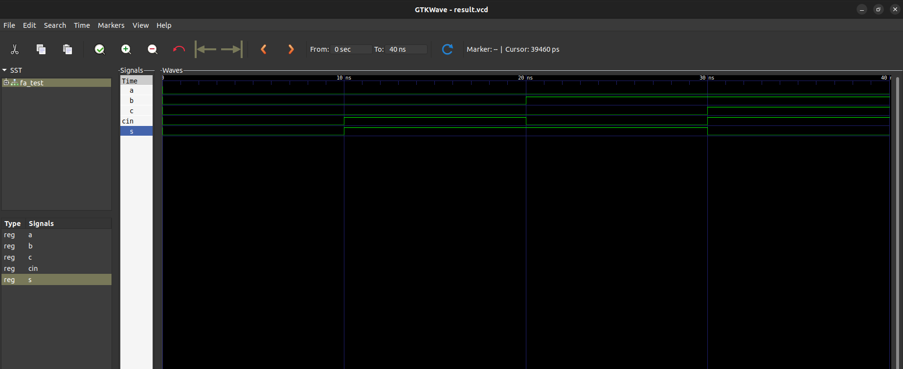

# Question
Using structural model,write a code in VHDL to implement full adder.(2077 ,2075 regular , 2073 back)

# Files

- `full_adder.vhdl` : vhdl code for full adder
- `full_adder_tb.vhdl` : vhdl code for testbench

# Simulation result

