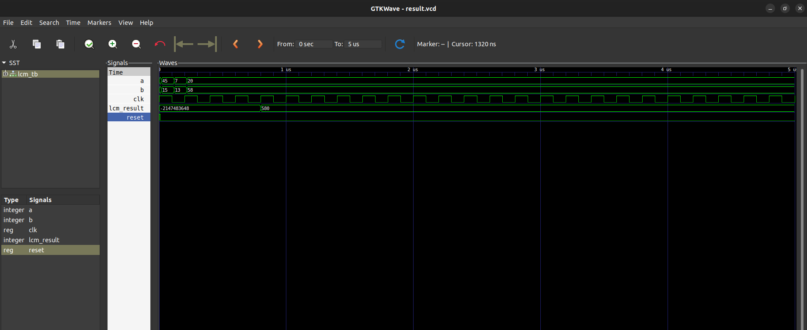

# Question
Write code for a custom processor that calculates Least Common Multiple (LCM) of two numbers as a finite state machine.(2074,2072 regular)

# Files

- `lcm.vhdl` : vhdl code for LCM
- `lcm_tb.vhdl` : vhdl code for testbench
  
# sFSM for LCM

# Simulation result

