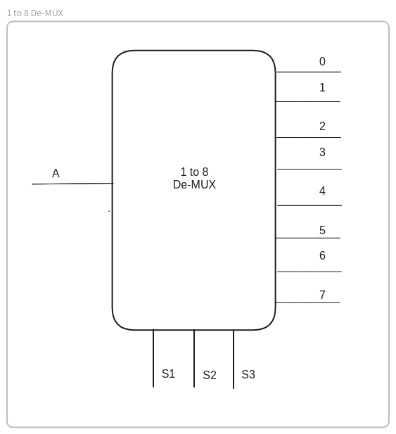
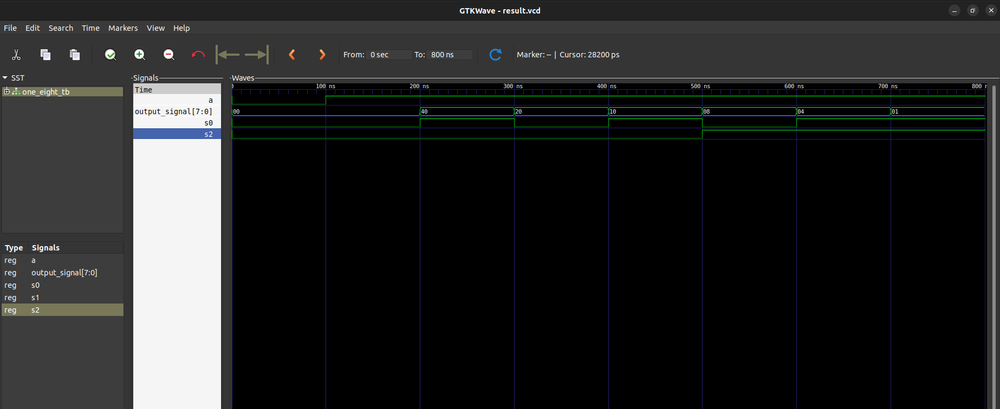

# Question
WRITE VHDL CODE TO IMPLEMENT 1 TO 8 DE-MULTIPLEXER.(2080 ASHWIN)

# Files

- `one-eight.vhdl` : vhdl code for One-eight de-multiplexer.
- `one_eight_tb.vhdl` : vhdl code for testbench entity and architecture.

# One-to-Eight De-multiplexer diagram

# Simulation result

