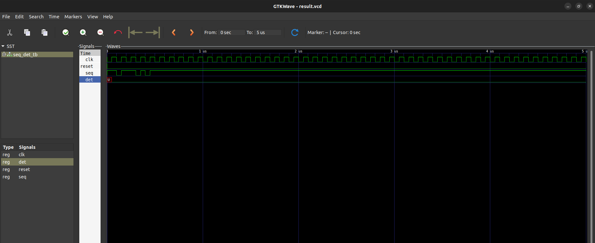

# Question
Design a sequence detector for the string "1101" that outputs when a one when the input matches this string , show the FSM and its VHDL implementation.(2070 back)

# Files

- `seq-det` : vhdl code for BCD counter entity and architecture.
- `seq_det_tb.vhdl` : vhdl code for testbench entity and architecture.

# FSM diagram

# Simulation result

