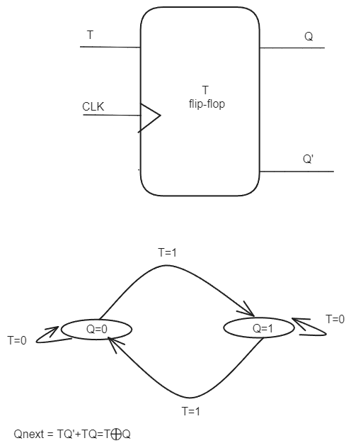
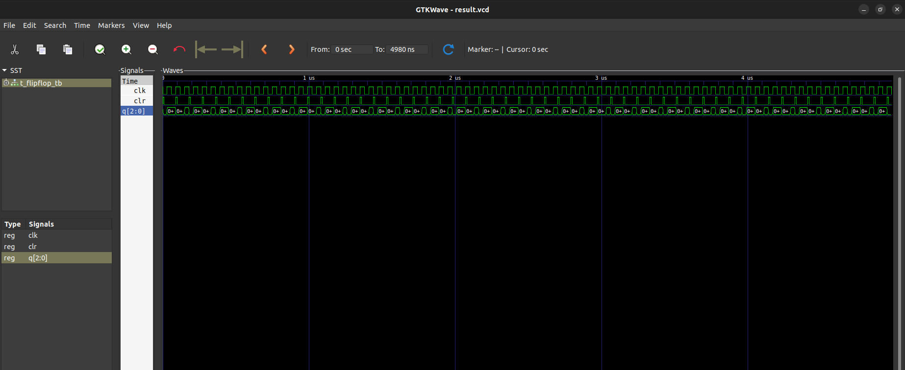

# Question
DESIGN A 3-BIT UP COUNTER USING T FLIPFLOP USING STRUCTURAL MODELING IN VHDL. (2079 ASHWIN)

# Files

- `t_flipflop.vhdl` : vhdl code for t-flipflop upcounter
- `t_flipflop_tb.vhdl` : vhdl code for testbench

# T flipflop 

# Simulation result

