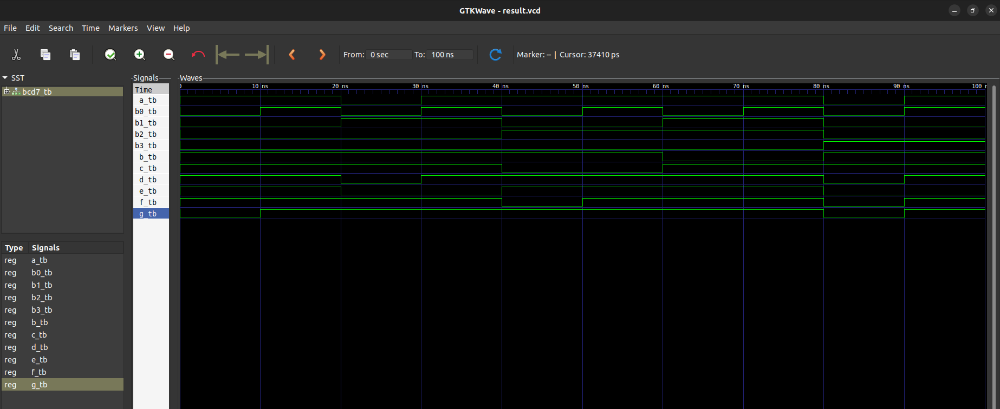

# Question
WRITE THE CODE FOR BCD COUNTER TO DISPLAY 0 TO 9999 IN SEVEN SEGMENT USING VHDL.(2070 regular)

# Files

- `bcd7.vhdl` : vhdl code for BCD counter entity and architecture.
- `bcd7_tb.vhdl` : vhdl code for testbench entity and architecture.

# Simulation result

