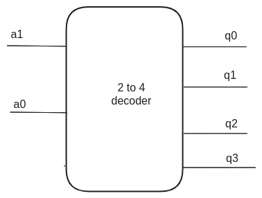
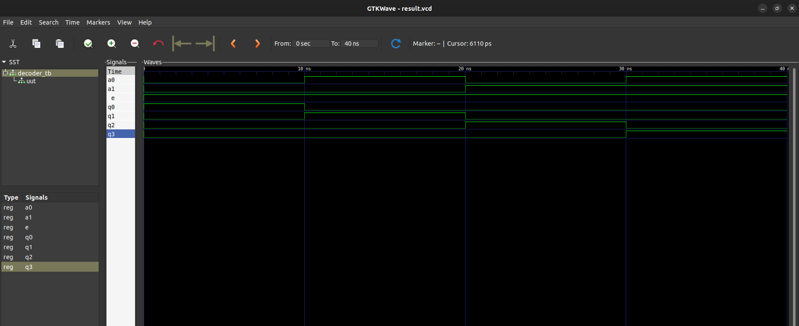

# Question
Design and write a code for Decoder using VHDL.(2076 back)

# Files

- `decoder.vhdl` : VHDL code for the decoding 4 bit
- `decoder_tb.vhdl` : VHDL code for testbench

# Decoder diagram

# Simulation result

