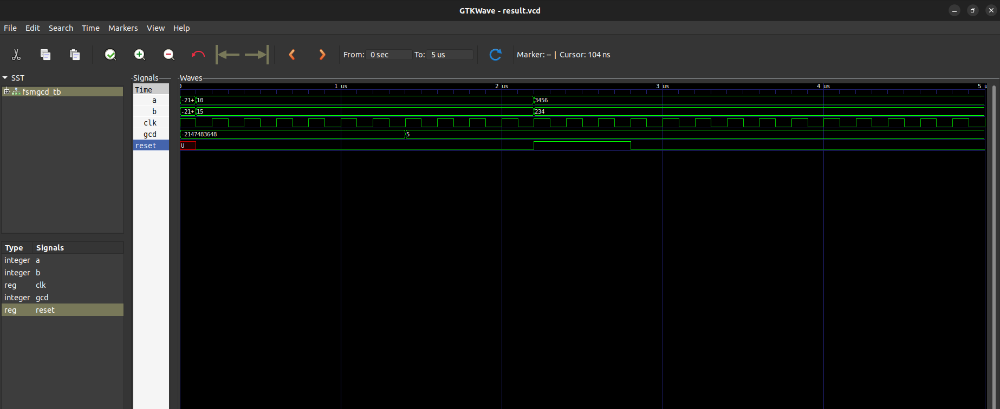

# Question
Write VHDL code for custom single purpose processor that calculates the Greatest Common Divisor(GCD) of two numbers as Finite State Machine.(2076 regular , 2073 ,2071,2069 regular)

# Files

- `gcd.vhdl` : VHDL code for gcd
- `gcd_tb.vhdl` : vhdl code for testbench 

# GCD fsm diagram

# Simulation result

